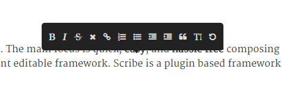

ghostWriter
===========

Medium like editor utilizing The Guardian's Scribe content editable framework.



Check out the [Demo](http://loljs.github.io/ghostwriter)

To Do
=====

Create Scribe plugin for images

Create Scribe plugin to handle links in a nicer way

Usage
=====

Clone or download.

```
npm install
```


Include a couple of `ghost-writer-editable` classes on content that you wish to make editable and add `ghostpress-plugin.min.js` at the end of your `body` element!


License
=======

MIT
